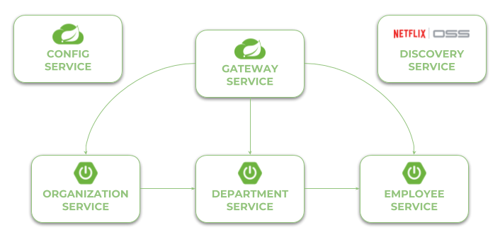

# Microservices with Spring Cloud Advanced Demo Project 

[](https://circleci.com/gh/sandipsable111/sample-spring-cloud-services)

[](https://sonarcloud.io/dashboard?id=sandipsable111_sample-spring-cloud-services)
[](https://sonarcloud.io/dashboard?id=sandipsable111_sample-spring-cloud-services)
[](https://sonarcloud.io/dashboard?id=sandipsable111_sample-spring-cloud-services)
[](https://sonarcloud.io/dashboard?id=sandipsable111_sample-spring-cloud-services)

In this project I'm demonstrating you the most interesting features of [Spring Cloud Project](https://spring.io/projects/spring-cloud) for building microservice-based architecture.

## Getting Started 
Currently you may find here some examples of microservices implementation using different projects from Spring Cloud. All the examples are divided into the branches and described in a separated articles on my blog. Here's a full list of available examples:
1. (This example has been update to the latest version of Spring Cloud without Zuul) Using Spring Cloud Netflix **Eureka** as a discovery server, **Zuul** as a gateway, **OpenFeign** for communication and Spring Cloud Config Server. 
2. Using Spring Cloud with Spring Boot support for **GraphQL** for building microservices, **Apollo** for inter-service communication and **Eureka** as a discovery server. The example is available in the branch 
3. Using Spring Boot and partially Spring Cloud for building microservices deployed on **OpenShift** with **Source-2-Image** mechanism. The example is available in the branch 
4. Using [Trampoline](http://ernestort.github.io/Trampoline/) for managing group of Spring Boot microservices locally. The example is available in the branch [trampoline](https://github.com/sandipsable111/sample-spring-cloud-services/tree/trampoline). 
5. Using Spring Boot 3, Micrometer Tracing and Springdoc for building microservices with Spring Cloud. A detailed guide may be found in the following article: 

### Usage

Build the apps with images (we need ji for `config-service` since it contains `curl`):
```shell
$ mvn clean package -Pbuild-image
```

Then run all the containers with `docker-compose`:
```shell
$ docker-compose up
```

In the most cases you need to have Maven and JDK8+. In the fourth example with OpenShift you will have to run **Minishift** on your machine. The best way to run the sample applications is with IDEs like IntelliJ IDEA or Eclipse.  

## Architecture

Our sample microservices-based system consists of the following modules:
- **gateway-service** - a module that Spring Cloud Netflix Zuul for running Spring Boot application that acts as a proxy/gateway in our architecture.
- **config-service** - a module that uses Spring Cloud Config Server for running configuration server in the `native` mode. The configuration files are placed on the classpath.
- **discovery-service** - a module that depending on the example it uses Spring Cloud Netflix Eureka or Spring Cloud Netlix Alibaba Nacos as an embedded discovery server.
- **employee-service** - a module containing the first of our sample microservices that allows to perform CRUD operation on in-memory repository of employees
- **department-service** - a module containing the second of our sample microservices that allows to perform CRUD operation on in-memory repository of departments. It communicates with employee-service. 
- **organization-service** - a module containing the third of our sample microservices that allows to perform CRUD operation on in-memory repository of organizations. It communicates with both employee-service and organization-service.

The following picture illustrates the architecture described above.

<br/>

